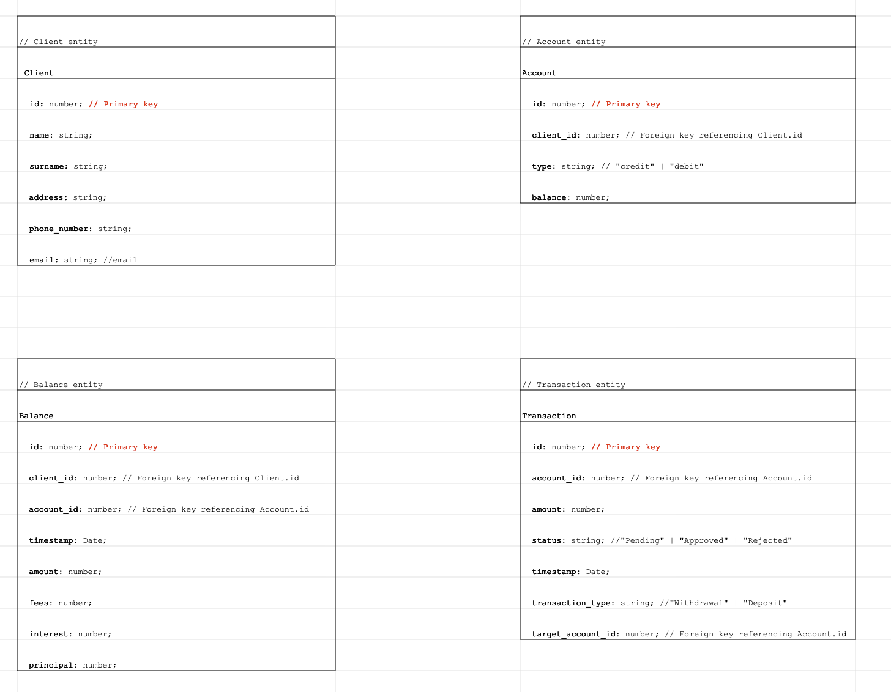
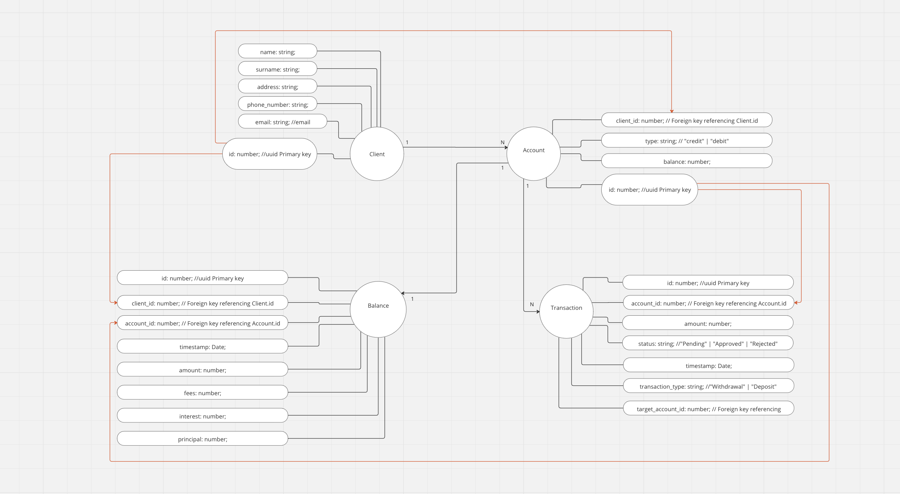

# Epptec Task

Datový model
1. Vytvořte jednoduchý datový model obsahující 4 základní entity: Klient, Účet, Transakce a Balance.
2. Naznačte základní sadu atributů v jednotlivých tabulkách, kardinalitu, primární/cizí klíče, apod.
3. V tabulce transakcí se bude vyskytovat TYP_TRANSAKCE, který bude odkazovat do číselníku typů transakcí.
4. Předpokládejte, že tabulka BALANCE obsahuje denní snímky nesoucí informaci o výši jednotlivých komponent pohledávky (jistina, úrok, poplatky) na konci dne.
5. Postavte dotaz, který vybere všechny klienty (např. id_klient, jméno a příjmení) pro něž bude platit, že suma jistin všech jejich účtů na konci měsíce bude větší než číslo c.
6. Postavte dotaz, který zobrazí 10 klientů s maximální celkovou výší pohledávky (suma všech pohledávek klienta) k ultimu měsíce a tuto na konci řádku vždy zobrazte.

## Table of Contents
* [Introduction](#introduction)
* [Data Model Diagrams](#data-model-diagrams)
* [Task 5 - Selecting Clients Based on Total Principal](#task-5---selecting-clients-based-on-total-principal)
* [Task 6 - Displaying Top 10 Clients by Total Balance](#task-6---displaying-top-10-clients-by-total-balance)
* [Algorithm Component](#algorithm-component)
* [Implementation](#implementation)
* [Challenges](#challenges)
* [Setup](#setup)

## Introduction

This project is a solution to the epptec task, which involves creating a simple data model consisting of four basic entities: Client, Account, Transaction, and Balance. Additionally, it includes writing logic to perform specific tasks on the data model.


### Data Model Diagrams





### Task 5 - Selecting Clients Based on Total Principal

#### Description:
The Task5 component is responsible for implementing logic to select clients based on the total principal of their accounts. It utilizes the `clientWithPrincipalGreatherThanC` function to filter clients whose total principal across all their accounts at the end of the month exceeds a given threshold value (denoted as 'c').

#### Functionality:
1. The component provides an input field labeled 'C', allowing users to specify the threshold value.
2. Upon entering a value for 'C', the component dynamically updates the list of selected clients based on the specified threshold.
3. The selected clients are displayed along with their IDs and names in the result section.

#### Usage:
Users can interact with the Task5 component by adjusting the 'C' value to filter clients meeting the specified criteria.

### Task 6 - Displaying Top 10 Clients by Total Balance

#### Description:
The Task6 component is responsible for sorting clients based on their total balance and displaying the top 10 clients with the highest total balance. It utilizes the `sortClientsByTopBalance` function to calculate the total balance of each client and then sorts them in descending order based on their total balance.

#### Functionality:
1. The component fetches the list of clients and their corresponding balances from the provided database.
2. It calculates the total balance of each client by summing up the amounts from their balances.
3. The clients are then sorted based on their total balance, with the top 10 clients selected.
4. The selected clients, along with their IDs, names, and total balances, are displayed in the result section.

#### Usage:
Users can view the top 10 clients with the highest total balance by accessing the Task6 component.

### Algorithm Component

#### Description:
The Algorithm component is designed to demonstrate specific algorithmic functionalities related to manipulating balance data from the database. It provides users with interactive controls to modify and filter balance data based on certain criteria.

#### Functionality:
1. **Displaying All Balances:** The component initially displays all balance entries from the database in a table format.
2. **Adjusting Interest Rate:** Users can input a percentage value to increase the interest rate for all balances in the database. Upon setting the percentage and triggering the update, the interest rates for all balances are recalculated accordingly.
3. **Removing Balances with Low Amount:** Users can click a button to remove all balance entries from the database where the amount is less than $5000. This functionality filters out balances that do not meet the specified criteria.
4. **Resetting:** There is a button available to reset the component, reverting all changes made to the balances and resetting the interest rate adjustment back to its initial state.

#### Usage:
Users can interact with the Algorithm component to observe how balance data can be manipulated based on user-defined parameters.

## Implementation

This project implements the data model and algorithms in a React application. It fetches data from a mock database and displays it in tables.

- Started with a Vite template for React with TypeScript.
- Created components for each table (ClientTable, AccountTable, TransactionTable, BalanceTable).
- Implemented logic for Task 5 and Task 6 in the App component.
- Styled the application using CSS.

## Challenges

- Difficulty with querying and filtering data.
- Handling date types in JavaScript.
- Deciding on the structure of the mock database.

## Setup
To run this project, install it locally using npm:
```
$ cd ../[directory]
$ npm install
$ npm start
```